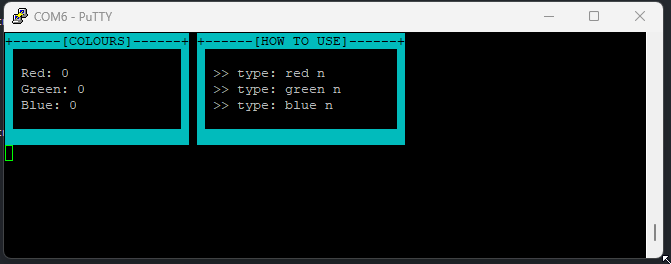

# CC2511 Labs
##  Embedded C Programming using Raspberry Pi Pico
filenames are hyperlinks to the lab sheet with my notes on them

- Lab 2 - Blinking the Pico's onboard LED
- Lab 3 - Toggling Lab board's RGB LED through the terminal [`Lab03.pdf`](Documentation/Lab03.pdf)
- Lab 4 - Lab 2 redone without any functions from the SDK [`Lab04.pdf`](Documentation/Lab04.pdf)
- Lab 5 - Using PWM to dim Lab board's RGB LED through the terminal [`Lab05.pdf`](Documentation/Lab05.pdf)
- Lab 5 sinewave - Self imposed extension to create a rainbow effect using PWM and phase shifted sine waves like so: <iframe src="https://www.desmos.com/calculator/g9djlcch9y?embed" width="500" height="500" style="border: 1px solid #ccc" frameborder=0></iframe>
- Lab 6 - Assignment related work
- Lab 7 - Using UART to create a simple interface to set the levels of the Lab board's RGB LED [`Lab07.pdf`](Documentation/Lab07.pdf)
- Lab 7gui - A nicer looking GUI that was much more painful to implement 
- Lab 8 - Setting the brightness of the RGB LED to be proportional to the light level of the Lab boards analogue light sensor[`Lab08.pf`](Documentation/Lab08.pdf)
- Lab 9 encoder - encode a secret message and transmit it by blinking the LED[`Lab09.pdf`](Documentation/Lab09.pdf)
- Lab 9 decoder - decode secret message [`Lab09.pdf`](Documentation/Lab9.pdf)
- Lab 10 - Redo Lab 2 using ARM assembly [`Lab11.pdf`](Documentation/Lab10.pdf)
- Lab 12 - Create the same computationally intense program in C and ARM assembly and compare their performance [`Lab12.pdf`](Documentation/Lab.pdf)

